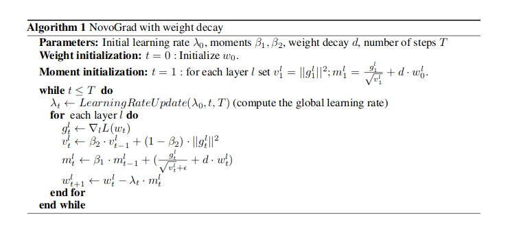
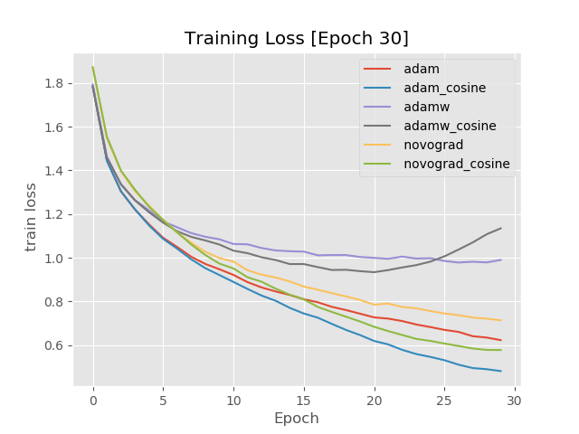
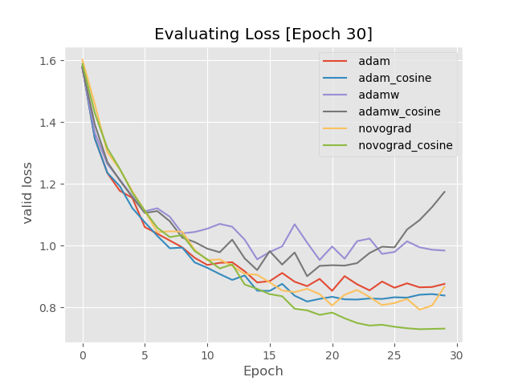
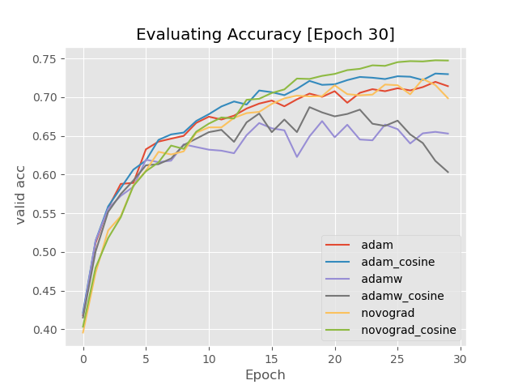

## NovoGrad Pytorch

This repository contains a PyTorch implementation of the NovoGrad Optimizer from the paper 

[Stochastic Gradient Methods with Layer-wise Adaptive Moments for Training of Deep Networks](https://arxiv.org/abs/1905.11286)

by Boris Ginsburg, Patrice Castonguay......

## Summarize

NovoGrad is a first-order SGD method with gradients normalized per layer. Borrowingfrom ND-Adam, NovoGrad uses the 2nd moment  for normalization and decouples weight decayfrom stochastic gradient for regularization as in AdamW.  NovoGrad has half the memoryconsumption compared to Adam (similar to AdaFactor, but with a simpler moment computation).Unlike AdaFactor, NovoGrad does not require learning rate warmup.



## Dependencies

* PyTorch
* torchvision
* matplotlib


## Usage

The code in this repository implements both NovoGrad and Adam training, with examples on the CIFAR-10 datasets.

Add the `optimizer.py` script to your project, and import it.

To use NovoGrad use the following command.

```python
from optimizer import NovoGrad
optimizer = NovoGrad(model.parameters(), lr=0.01,betas=(0.95, 0.98),weight_decay=0.001)
```

## Example

To produce the result,we use CIFAR-10 dataset for ResNet18.

```python
# use adam
python run.py --optimizer-adam --model=alexnet

# use novograd
python run.py --optimizer=novograd --model=alexnet

# use adamW
python run.py --optimizer=adamw --model=alexnet

# use lr scheduler
python run.py --optimizer=adam --model=alexnet --do_scheduler
python run.py --optimizer=novograd --model=alexnet --do_scheduler
python run.py --optimizer=adamw --model=alexnet --do_scheduler
```
## Alexnet Results

Train loss of adam ,adamw and  novograd with Alexnet on CIFAR-10.



Valid loss of adam ,adamw and novograd with Alexnet on CIFAR-10.



Valid accuracy of adam ,adamw and novograd with Alexnet on CIFAR-10.



